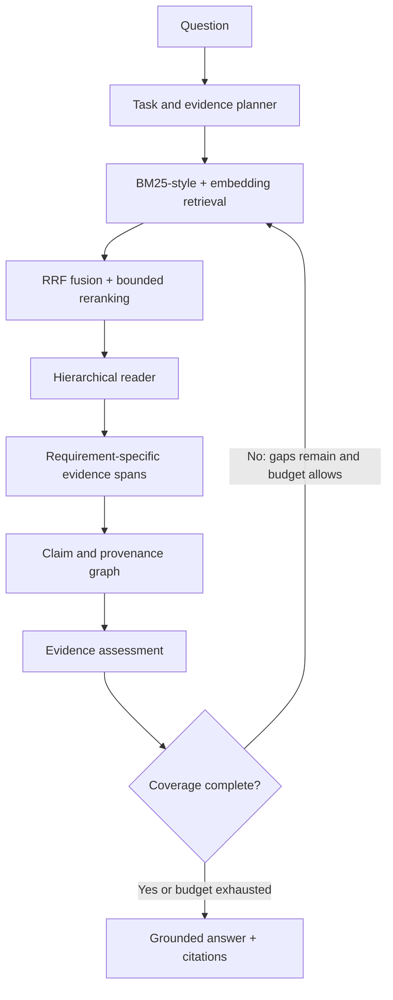

# DeepRead · EvidenceGraph

**An inspectable retrieval and reasoning system that plans evidence needs, reads documents under a dynamic budget, and produces claim-level citations.**

DeepRead explores a practical retrieval question:

> Can a retrieval system improve evidence coverage and citation reliability while reading less source material than flat top-k RAG?

The system covers corpus parsing, hybrid retrieval, hierarchical reading, evidence-memory structures, bounded model orchestration, citation validation, API and UI surfaces, token accounting, and reproducible evaluation. It runs either entirely offline or with OpenAI models and embeddings.

## The problem

Conventional RAG systems usually retrieve a fixed number of passages and send all of them to a generator. That design is simple, but it leaves several questions unanswered:

- What facts must be supported before the system can answer?
- Which retrieved passages fill an actual evidence gap?
- When is another search or deeper read justified?
- Which exact source span supports each generated claim?
- How much source text and model traffic did the answer require?

DeepRead makes those decisions explicit. It converts a question into evidence requirements, searches through complementary retrieval channels, evaluates possible reading actions by expected evidence gain per token, and stops when coverage or a hard budget is reached.

## System design



The online loop is deliberately constrained:

- At most three task nodes and four evidence requirements
- At most two retrieval rounds
- At most 20 reranked candidates
- A 12K source-reading budget
- One requirement-specific evidence node per support decision
- Full-document reads only when cheaper views have lower utility

## Components

### 1. Hybrid retrieval

- BM25-style lexical scoring for exact terminology
- OpenAI embeddings or a dependency-free character-vector fallback
- Reciprocal-rank fusion across retrieval channels
- Candidate deduplication, metadata features, and redundancy penalties
- Content-addressed embedding caches to avoid repeated corpus indexing cost
- Optional structured model reranking over a bounded candidate pool

### 2. Hierarchical, budgeted reading

Documents are represented at five levels:

```text
title → summary → section → passage → full document
```

The reader scores actions by expected requirement-coverage gain divided by read cost. It evaluates actions across all candidates instead of accepting the first match. Model-generated keyword phrases are normalized into the same token space used by the reader.

Broad reads never become broad citations. Before evidence enters memory, the system refines it to a requirement-specific passage and a contiguous sentence window with exact character offsets.

### 3. Evidence and claim memory

- Requirement → evidence support edges
- Claim → evidence citation edges
- Source document, section, passage, and span provenance
- Support, challenge, and insufficient-evidence relations
- Query-scoped in-memory graph with optional SQLite persistence
- Application-side citation validation: a claim cannot cite evidence assigned to another requirement

### 4. Bounded model orchestration

The OpenAI execution path uses structured outputs for:

- Evidence planning
- Candidate reranking
- Evidence assessment
- Grounded synthesis

The controller—not the model—owns search limits, read budgets, coverage calculation, evidence IDs, citation markers, and stopping behavior. `store=false` is the default.

### 5. Observability and evaluation

Every query produces a JSON trace containing:

- Planned tasks and evidence requirements
- Retrieval rounds and fused ranking components
- Selected and rejected read actions with utility and reason
- Requirement-specific evidence spans and character offsets
- Claim-to-evidence links and coverage decisions
- Stop reason and provider configuration
- Per-operation API input, output, total, and cached tokens

Token accounting is separated into three quantities:

- `read_tokens`: source views actually opened
- `citation_tokens`: exact source text exposed as evidence
- `api_total_tokens`: provider-reported orchestration traffic

Optional cost estimates use user-supplied current rates rather than hardcoded pricing.

## Live trace case study

The checked-in [latest live trace](traces/latest.json) answers:

> Why do wetlands reduce floods and mitigate climate change?

| Result | Observed value |
|---|---:|
| Search rounds | 1 |
| Evidence requirements | 3 |
| Requirement coverage | 100% model-assessed |
| Supporting evidence nodes | 3 |
| Selected full-document reads | 0 |
| Read tokens | 136 |
| Citation tokens | 123 |
| API tokens | 3,350 |

Each requirement maps to a different passage-level evidence node: flood attenuation, carbon storage, and methane tradeoffs. All three generated claims cite only their assigned source span.

This is an illustrative integration test, not a research result. It also exposes the next optimization target: model orchestration remains much more expensive than source reading, with reranking accounting for the largest share of API traffic.

## Evaluation strategy

The evaluation runner uses QASPER scientific papers, information-seeking questions, multiple
answer annotations, and gold supporting evidence. It supports both paper-known evaluation, which
isolates passage selection and synthesis, and corpus-wide evaluation, which also tests document
discovery.

Every question produces a standalone trace and a checkpointed result row. Runs are fingerprinted
from the corpus, question set, model configuration, and metric settings, so interrupted experiments
can resume without mixing incompatible results.

The initial evaluation will compare:

1. BM25 only
2. Embeddings only
3. Flat hybrid top-k RAG
4. Hybrid retrieval plus model reranking
5. Hierarchical reading
6. The complete bounded EvidenceGraph loop

Primary measurements:

- Recall@20, MRR@10, and nDCG@10
- Official-style answer F1 with maximum-over-annotator scoring
- Gold evidence precision, recall, and F1
- Yes/no and unanswerable accuracy
- Passage-level citation precision/recall and highlighted-span overlap
- Requirement coverage and stopping behavior
- Full-document open rate
- Read and citation tokens per correct answer
- Total API tokens, latency, and estimated cost per correct answer

Efficiency denominators treat answer F1 ≥ 0.5 as correct by default; the threshold is recorded in
the run fingerprint and can be changed with `--correct-threshold`.

The first milestone is a paper-known pilot over approximately 10 QASPER validation papers and 30–50 questions, followed by a 50-paper corpus-wide retrieval study.

## Run it locally

Python 3.11+ is required.

```bash
git clone https://github.com/wubis/DeepRead.git
cd DeepRead
python -m venv .venv
source .venv/bin/activate
pip install -e '.[app,openai,eval,dev]'
```

The default `auto` provider uses OpenAI when `OPENAI_API_KEY` is present and otherwise runs offline.

```bash
# Offline, with no paid API dependency
deepread ask \
  "Why do wetlands reduce floods and mitigate climate change?" \
  --provider offline

# OpenAI-backed pipeline
export OPENAI_API_KEY='your-key'
deepread ask \
  "Why do wetlands reduce floods and mitigate climate change?" \
  --provider openai \
  --trace traces/latest.json
```

Never commit a real API key. `.env` files are ignored, and [.env.example](.env.example) documents the supported configuration.

## Explore the system

### Streamlit trace inspector

```bash
streamlit run app.py
```

Open `http://localhost:8501` to inspect the task graph, citations, read decisions, coverage, and API usage.

### FastAPI service

```bash
uvicorn deepread.api:app --reload
```

```bash
curl -X POST http://localhost:8000/v1/query \
  -H 'content-type: application/json' \
  -d '{"question":"Why is hybrid retrieval useful?"}'
```

### Docker

```bash
docker compose up --build
```

The API is exposed on port `8000`; the Streamlit inspector is exposed on port `8501`.

## Tests and benchmarks

```bash
pytest -q
ruff check src tests benchmark app.py

# Cost-safe paper-known pilot: 10 validation papers, at most 50 questions
python benchmark/run.py

# Evaluate a downloaded official QASPER JSON/JSONL file
python benchmark/run.py --qasper-path /path/to/qasper-dev-v0.3.json

# Corpus-wide retrieval over 50 papers
python benchmark/run.py \
  --mode corpus-wide \
  --max-papers 50 \
  --max-questions 0 \
  --output benchmark/results/qasper-corpus-wide.json

# Explicit paid-provider evaluation
python benchmark/run.py \
  --provider openai \
  --output benchmark/results/qasper-openai.json
```

Evaluation defaults to offline mode even when a key exists. Results are checkpointed after every
question and resume automatically when the run fingerprint matches. Use `--no-resume` to replace
an existing run. Health checks and corpus inspection never issue API requests.

## Use another corpus

The current parser accepts `.md` and `.txt` documents. Markdown headings become sections and prose is divided into bounded passages.

```bash
deepread inspect --corpus /path/to/corpus
deepread ask \
  "Your question" \
  --corpus /path/to/corpus \
  --trace traces/question.json
```

QASPER ingestion is included below. PDF, DOCX, HTML, and additional dataset adapters can be
added without changing the retrieval and evaluation contracts.

### QASPER

The QASPER adapter preserves original abstracts, section headings, paragraphs, and
figure/table captions as individually addressable source units. Gold evidence and highlighted
spans remain separate from the runtime corpus and retain all matching source IDs and character
offsets; unresolved annotations remain visible for evaluation audits.

```bash
pip install -e '.[eval]'
```

```python
from deepread.engine import EvidenceGraphEngine
from deepread.qasper import load_qasper_hf

dataset = load_qasper_hf("validation")
paper_ids = [dataset.documents[0].metadata["paper_id"]]
engine = EvidenceGraphEngine(dataset.corpus(paper_ids))
answer = engine.ask(dataset.questions_for(paper_ids)[0].question)
```

## Repository map

```text
src/deepread/
├── corpus.py            # Hierarchical parsing and passage identity
├── qasper.py            # Provenance-preserving QASPER ingestion
├── evaluation.py        # Answer, evidence, ranking, citation, and efficiency metrics
├── evaluation_runner.py # Resumable QASPER execution and checkpoint orchestration
├── retrieval.py         # Lexical, semantic, and fused retrieval
├── planner.py           # Deterministic evidence planner
├── openai_provider.py   # Structured planning, reranking, assessment, synthesis
├── reader.py            # Dynamic read policy and span refinement
├── memory.py            # Evidence/claim graph and SQLite persistence
├── synthesis.py         # Offline grounded synthesis
├── engine.py            # Bounded orchestration and trace accounting
├── api.py               # FastAPI application
└── models.py            # Typed domain and trace records

benchmark/               # Resumable QASPER evaluation CLI
data/sample_corpus/      # Small local demonstration corpus
tests/                   # Unit, integration, mocked-provider, and negative tests
traces/                  # Inspectable query traces
```

## Engineering decisions and tradeoffs

- **Deterministic control, probabilistic components.** Models propose structured plans and judgments; code enforces budgets, IDs, citation scope, and stop conditions.
- **Offline parity.** Core behavior remains runnable without paid services, enabling deterministic tests and meaningful provider comparisons.
- **Evidence before prose.** Synthesis receives only stored evidence and cannot invent citation identifiers.
- **Cost is part of quality.** The benchmark tracks total provider traffic separately from retrieved source text.
- **Local-first architecture.** SQLite and in-process indexes keep the system reproducible; distributed storage, queues, ACLs, and multitenancy are intentionally deferred.

## Current boundaries and roadmap

The current implementation intentionally defers learned reading policies, persistent global entity resolution, comprehensive contradiction modeling, distributed indexes, and production multitenancy.

Near-term work:

- Configurable retrieval and reader ablations
- Paper-known and corpus-wide QASPER result studies
- PDF/HTML parsing with layout-aware provenance
- Retrieval and reader ablations
- Per-query cost reporting with current configured rates
- Citation-error analysis and evidence-window calibration
- Benchmark visualizations and an end-to-end system walkthrough

The project is structured so these additions can replace or extend individual components without weakening the trace, budget, and provenance contracts.
